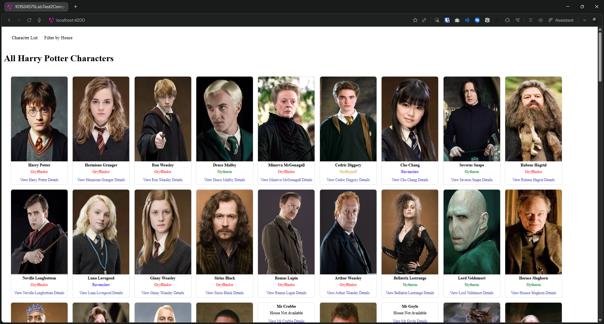
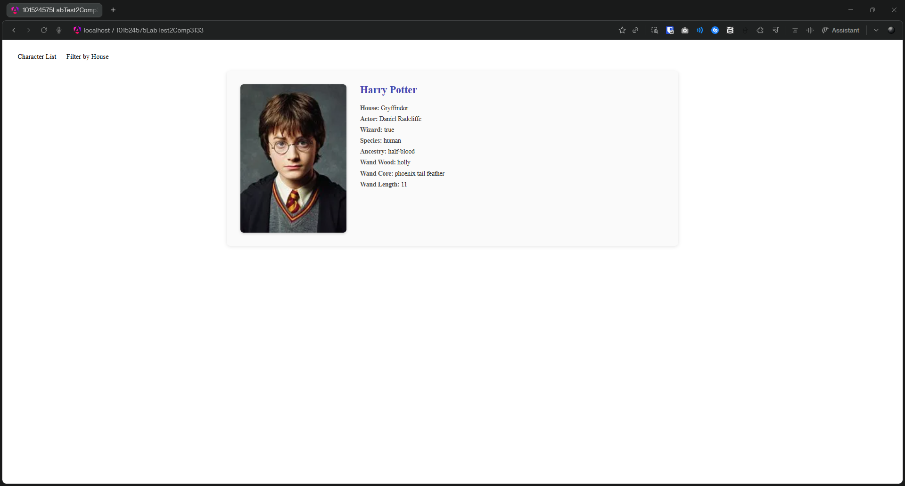
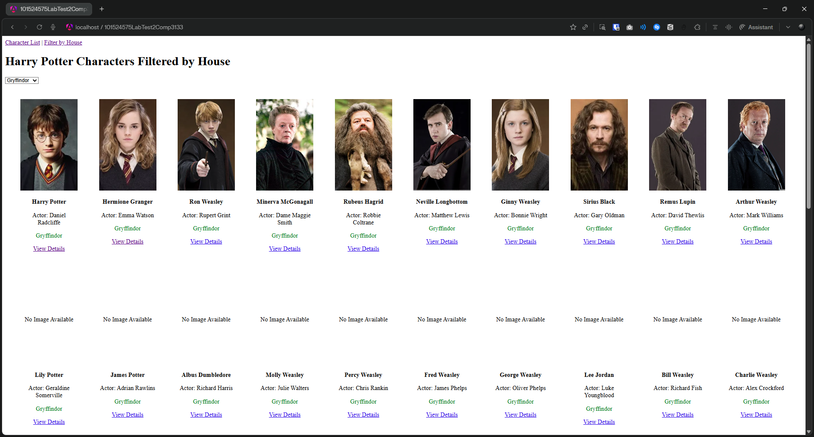
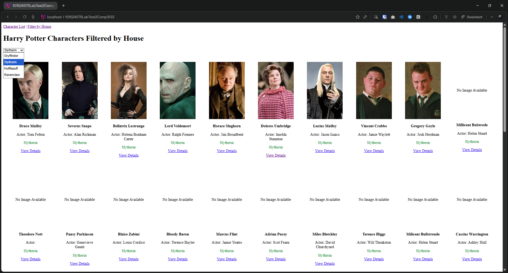

# COMP3133 LAB TEST 2
# Woohyuk (Harry) Song | 101524575

## Description
Angular application to browse Harry Potter characters using a public Harry Potter API.

## Features
- View all characters (name, house, image)
- Filter characters categorized by Hogwarts house
- View detailed character information (name, actor, wizard t/f, species, ancestry, wand (wood type, core type, lenght), image)

## Screenshots
Character List

Character Details

Filtered by House #1

Filtered by House #2

## Currently Hosted/Deployed At:
https://101524575-lab-test2-comp3133.vercel.app/

## How to Run the Application
1. Clone the repo using `git clone https://github.com/harrywsong/101524575-lab-test2-comp3133.git`
2. Run `cd 101524575-lab-test2-comp3133`
3. Run `npm install`
4. Run `ng serve`
5. Open `http://localhost:4200`